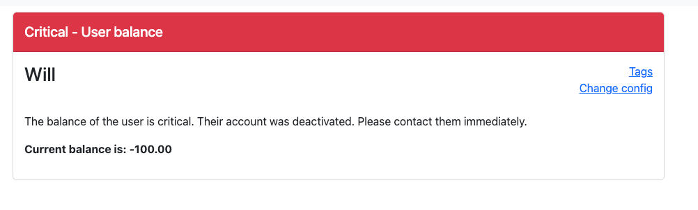
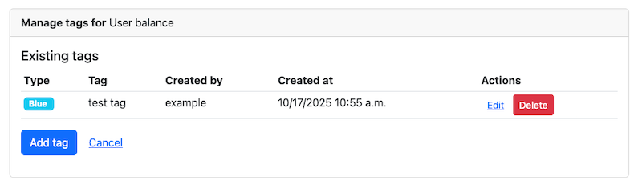
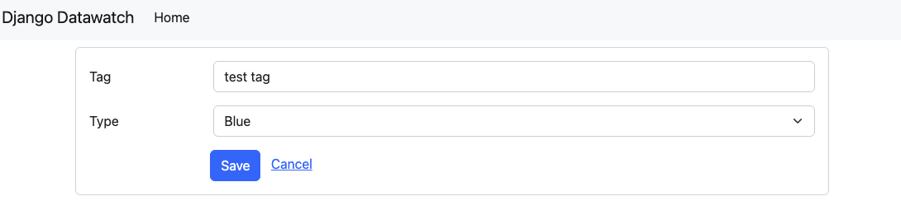
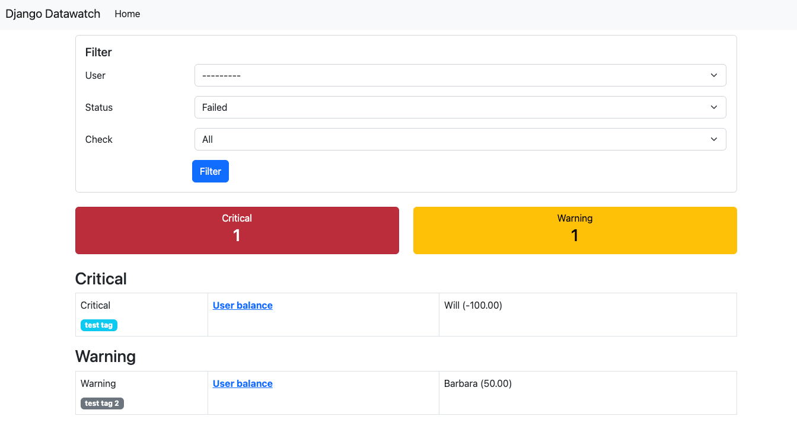

[](https://badge.fury.io/py/django-datawatch)
[](https://github.com/RegioHelden/django-datawatch/actions)
[](https://github.com/ellerbrock/open-source-badges/)
[](https://opensource.org/licenses/mit-license.php)

# Django Datawatch

With Django Datawatch you are able to implement arbitrary checks on data, review their status and even describe what to do to resolve them.
Think of [nagios](https://www.nagios.org/)/[icinga](https://www.icinga.org/) for data.

## Check execution backends

### Synchronous

Will execute all tasks synchronously which is not recommended but the most simple way to get started.

### Celery

Will execute the tasks asynchronously using celery as a task broker and executor.
Requires celery 5.0.0 or later.

### Other backends

Feel free to implement other task execution backends and send a pull request.

## Install

```shell
$ pip install django-datawatch
```

Add `django_datawatch.apps.DjangoDatawatchConfig` to your `INSTALLED_APPS`

## Celery beat database scheduler

If the datawatch scheduler should be run using the celery beat database scheduler, you need to install [django_celery_beat](hhttp://docs.celeryproject.org/en/latest/userguide/periodic-tasks.html#beat-custom-schedulers).

Add `django_datawatch.tasks.django_datawatch_scheduler` to the `CELERYBEAT_SCHEDULE` of your app.
This task should be executed every minute e.g. `crontab(minute='*/1')`, see example app.

## Write a custom check

Create `checks.py` inside your module.

```python
from datetime import datetime

from celery.schedules import crontab

from django_datawatch.datawatch import datawatch
from django_datawatch.base import BaseCheck, CheckResponse
from django_datawatch.models import Result


@datawatch.register
class CheckTime(BaseCheck):
    run_every = crontab(minute='*/5')  # scheduler will execute this check every 5 minutes

    def generate(self):
        yield datetime.now()

    def check(self, payload):
        response = CheckResponse()
        if payload.hour <= 7:
            response.set_status(Result.STATUS.ok)
        elif payload.hour <= 12:
            response.set_status(Result.STATUS.warning)
        else:
            response.set_status(Result.STATUS.critical)
        return response

    def get_identifier(self, payload):
        # payload will be our datetime object that we are getting from generate method
        return payload

    def get_payload(self, identifier):
        # as get_identifier returns the object we don't need to process it
        # we can return identifier directly
        return identifier

    def user_forced_refresh_hook(self, payload):
        payload.do_something()
```

### .generate

Must yield payloads to be checked. The check method will then be called for every payload.

### .check

Must return an instance of CheckResponse.

### .get_identifier

Must return a unique identifier for the payload. 

### .user_forced_refresh_hook

A function that gets executed when the refresh is requested by a user through the `ResultRefreshView`.

This is used in checks that are purely based on triggers, e.g. when a field changes the test gets executed.

### trigger check updates

Check updates for individual payloads can also be triggered when related datasets are changed.
The map for update triggers is defined in the Check class' trigger_update attribute.

```
trigger_update = dict(subproduct=models_customer.SubProduct)
```

The key is a slug to define your trigger while the value is the model that issues the trigger when saved.
You must implement a resolver function for each entry with the name of get_<slug>_payload which returns the payload or multiple payloads (as a list) to check (same datatype as .check would expect or .generate would yield).
```
def get_subproduct_payload(self, instance):
    return instance.product
```

### define an individual queue

You can force specific checks to run in different queues (e.g. in the `celery` backend). \
Set the `queue` parameter of your Check class to the name of the queue.

## Exceptions

#### `DatawatchCheckSkipError`
raise this exception to skip current check. The result will not appear in the checks results. 

## Run your checks

A management command is provided to queue the execution of all checks based on their schedule.
Add a crontab to run this command every minute and it will check if there's something to do.

```shell
$ ./manage.py datawatch_run_checks
$ ./manage.py datawatch_run_checks --slug=example.checks.UserHasEnoughBalance
```

## Refresh your check results

A management command is provided to forcefully refresh all existing results for a check.
This comes in handy if you changes the logic of your check and don't want to wait until the periodic execution or an update trigger.

```shell
$ ./manage.py datawatch_refresh_results
$ ./manage.py datawatch_refresh_results --slug=example.checks.UserHasEnoughBalance
```

## Get a list of registered checks

```shell
$ ./manage.py datawatch_list_checks
```

## Clean up your database

Remove the unnecessary check results and executions if you've removed the code for a check.

```shell
$ ./manage.py datawatch_clean_up
```

## Settings

```python
DJANGO_DATAWATCH_BACKEND = 'django_datawatch.backends.synchronous'
DJANGO_DATAWATCH_RUN_SIGNALS = True
```

### DJANGO_DATAWATCH_BACKEND

You can chose the backend to run the tasks. Supported are 'django_datawatch.backends.synchronous' and 'django_datawatch.backends.celery'.

Default: 'django_datawatch.backends.synchronous'

### DJANGO_DATAWATCH_RUN_SIGNALS

Use this setting to disable running post_save updates during unittests if required.

Default: True

### celery task queue

Datawatch supported setting a specific queue in release < 0.4.0

With the switch to celery 4, you should use task routing to define the queue for your tasks, see http://docs.celeryproject.org/en/latest/userguide/routing.html

To be able to run specific tasks in a different queue, one can use the `queue` attribute on the `Check` subclass. This is meant to be a string representing the name of the queue. This is currently only supported by the celery backend.

## Migrating from 3.x to 4.x

In `4.x`, the base check class supports two new methods (`get_assigned_users` and `get_assigned_groups`). This is a breaking change as the old `get_assigned_user` and `get_assigned_group` methods have been removed.

This change allows checks to assign multiple users and groups to a check. If you have implemented custom checks, you need to update your code to return a list of users and groups instead of a single user and group. e.g.

From

```python
from django_datawatch.base import BaseCheck

class CustomCheck(BaseCheck):
    ...
    def get_assigned_user(self, payload, result) -> Optional[AbstractUser]:
        return None # or a user
    def get_assigned_group(self, payload, result) -> Optional[Group]:
        return None # or a group
```

To

```python
from django_datawatch.base import BaseCheck

class CustomCheck(BaseCheck):
    ...
    def get_assigned_users(self, payload, result) -> Optional[List[AbstractUser]]:
        return None  # or a list of users
    def get_assigned_groups(self, payload, result) -> Optional[List[Group]]:
        return None  # or a list of groups
```

## Tagging Results

Django Datawatch supports tagging individual check results. You can add, edit, and remove tags for each result directly through the web interface.
### Usage

- **Manage tags**: Open the result detail and click on the Tags link to manage tags.
Each tag includes a label, a type (color/status), and the user who created it.





- **Tag display**: Tags are displayed as colored badges in the results overview, based on their type.



# CONTRIBUTE

## Dev environment
- Latest [Docker](https://docs.docker.com/) with the integrated compose plugin

Please make sure that no other container is using port 8000 as this is the one you're install gets exposed to:
http://localhost:8000/

## Setup

We've included an example app to show how django_datawatch works.
Start by launching the included docker container.
```bash
docker compose up -d
```

Then setup the example app environment.
```bash
docker compose run --rm app migrate
docker compose run --rm app loaddata example
```
The installed superuser is "example" with password "datawatch".

## Run checks

Open http://localhost:8000/, log in and then go back to http://localhost:8000/.
You'll be prompted with an empty dashboard. That's because we didn't run any checks yet.
Let's enqueue an update.
```bash
docker compose run --rm app datawatch_run_checks --force
```

The checks for the example app are run synchronously and should be updated immediately.
If you decide to switch to the celery backend, you should now start a celery worker to process the checks.
```bash
docker compose run --rm --entrypoint celery app -A example worker -l DEBUG
```

To execute the celery beat scheduler which runs the datawatch scheduler every minute, just run:
```bash
docker compose run --rm --entrypoint celery app -A example  beat --scheduler django_celery_beat.schedulers:DatabaseScheduler
```

You will see some failed check now after you refreshed the dashboard view.


## Run the tests
```bash
docker compose run --rm app test
```
## Translations

Collect and compile translations for all registered locales

```bash
docker compose run --rm app makemessages --no-location --all
docker compose run --rm app compilemessages
```

## Making a new release

This project makes use of [RegioHelden's reusable GitHub workflows](https://github.com/RegioHelden/github-reusable-workflows). \
Make a new release by manually triggering the `Open release PR` workflow.
